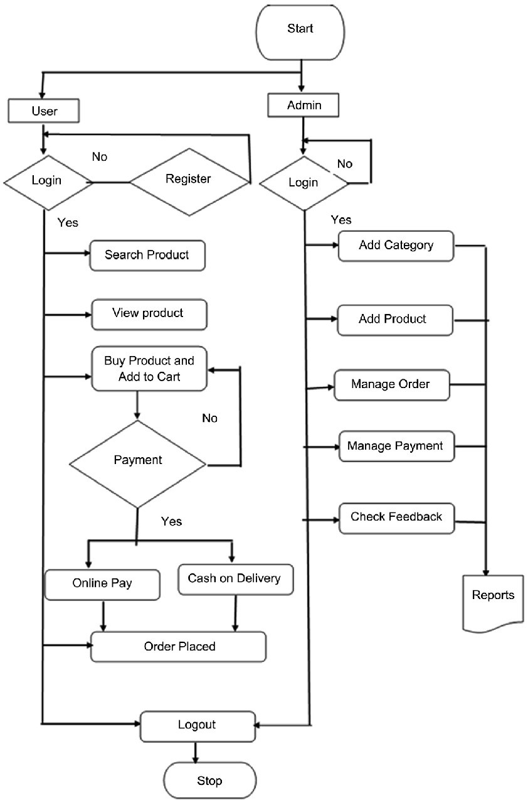

# Shopcart - E-Commerced Website
## Introduction
This website is made with the help of Django framework. Django is a free, open-source, high-level Python web framework that facilitates rapid development and pragmatic & clean code. It was created to support web application development, web APIs, and web services.
Benefits of Django include usage of python, highly secure, scalable and reliable, set of libraries, excellent community and documentation.

The objective of our project is to develop a real time E-commerce website for the delivery of commercial items. This website will provide local shops with the facility to sell their products online. Customers will have the luxury to view, compare and select the products from multiple local shops that they want to buy. There will be two options to place order: 
1. Sit at home, pay online and get the delivery.
2. Book item and get it from the shop in person.
The benefit for the user in this will be that they don't have to go to the market continuously to check if some things are available in any particular shop or not.

## Requirements
1. Database Management System - Django Administration
2. Runtime Environment - PyCharm or Visual Studio Code

## Design Flow

